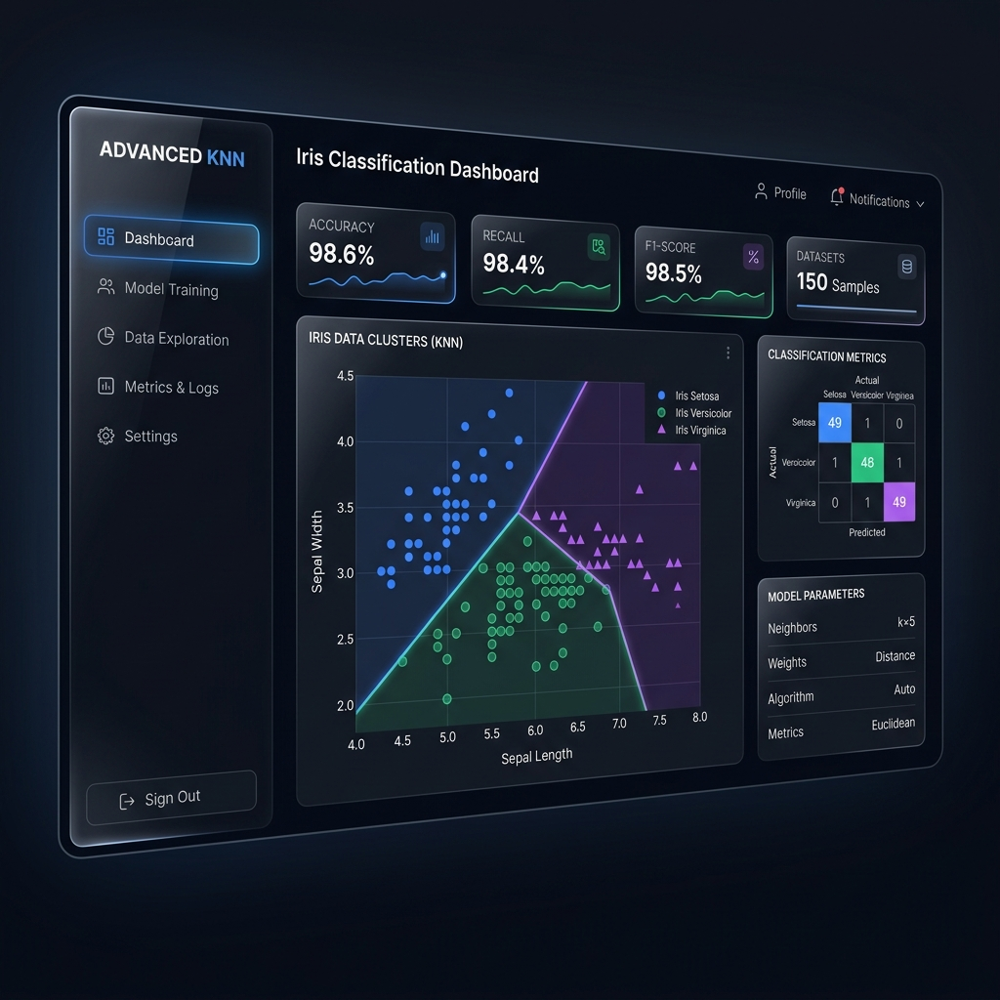
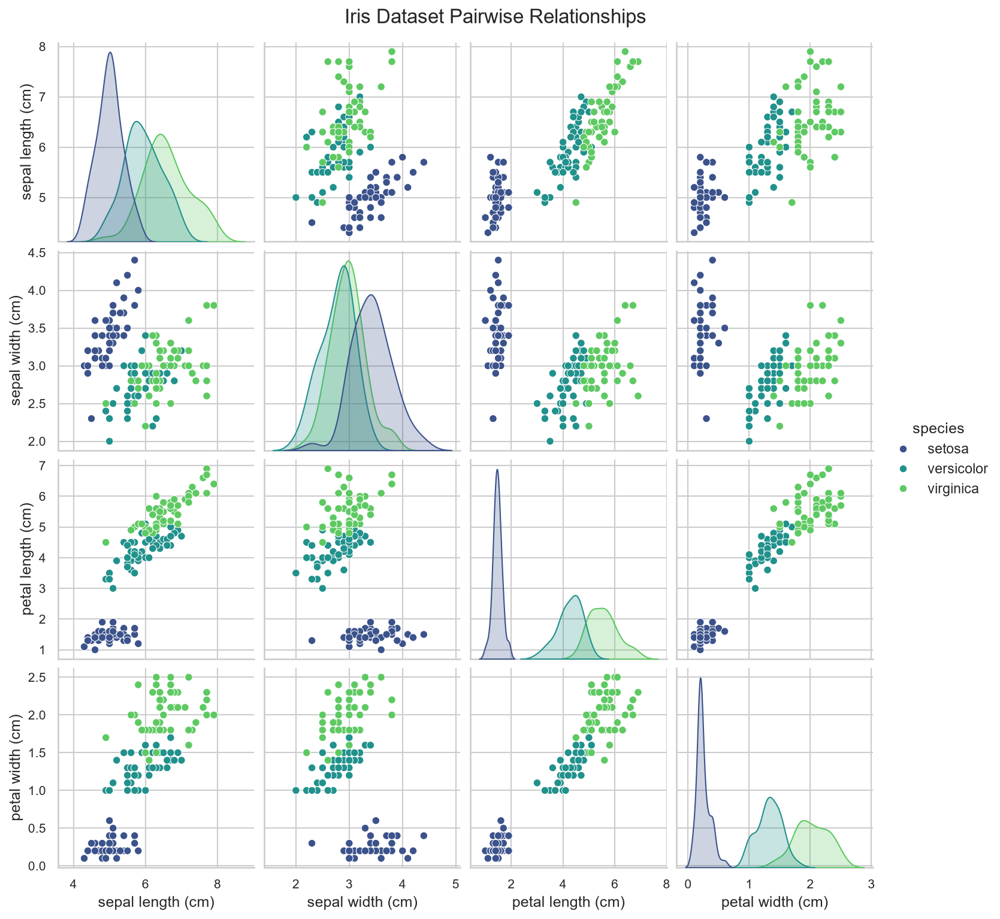
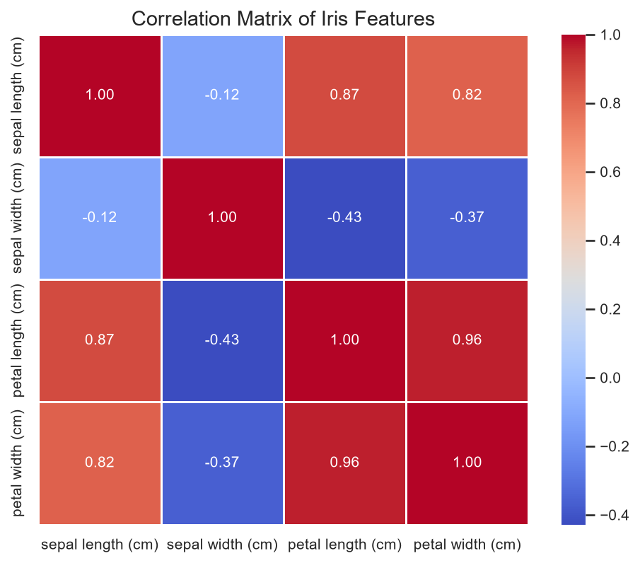
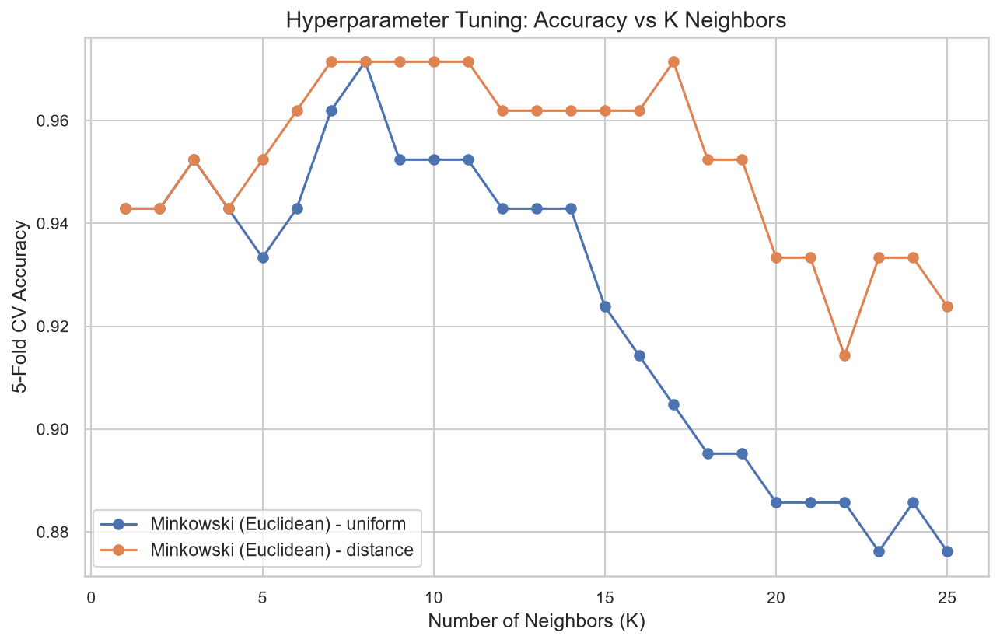
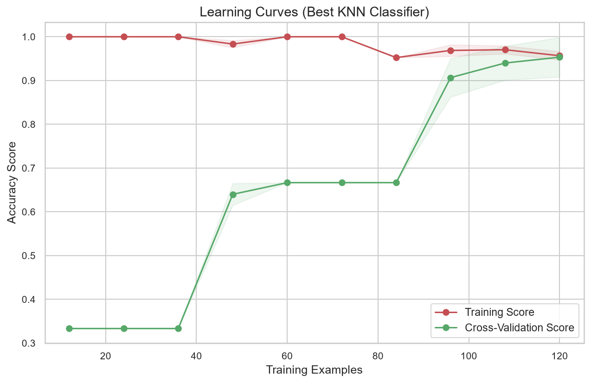
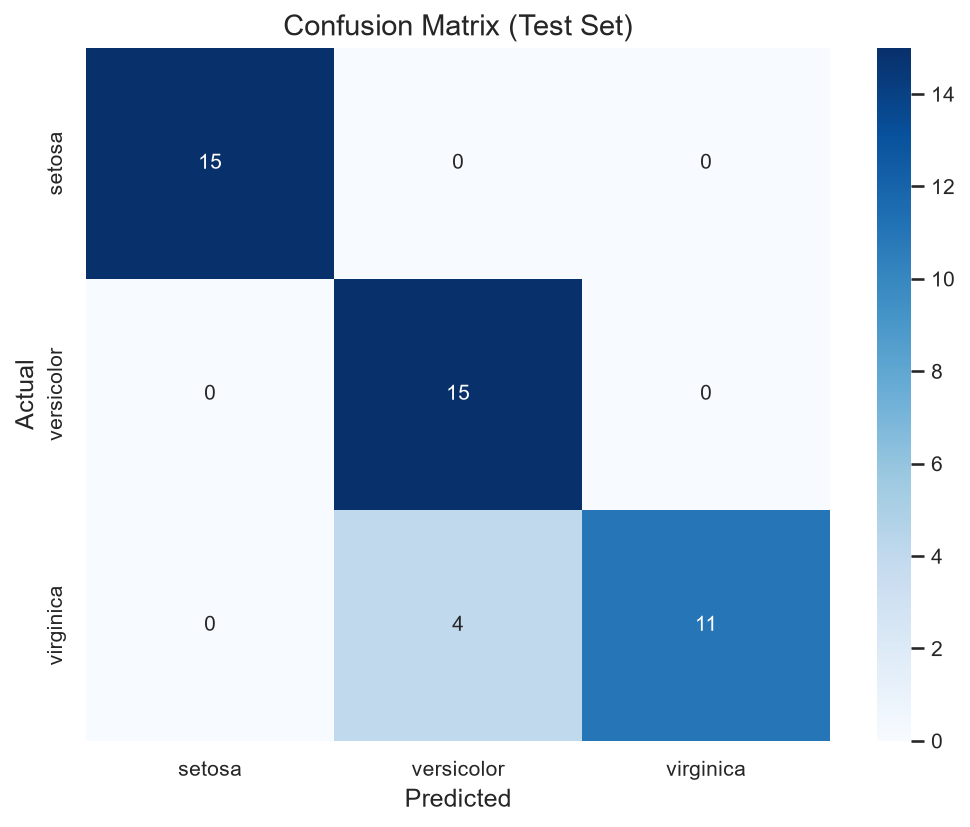
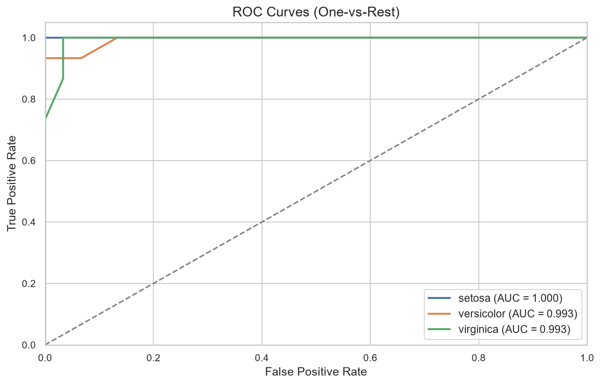
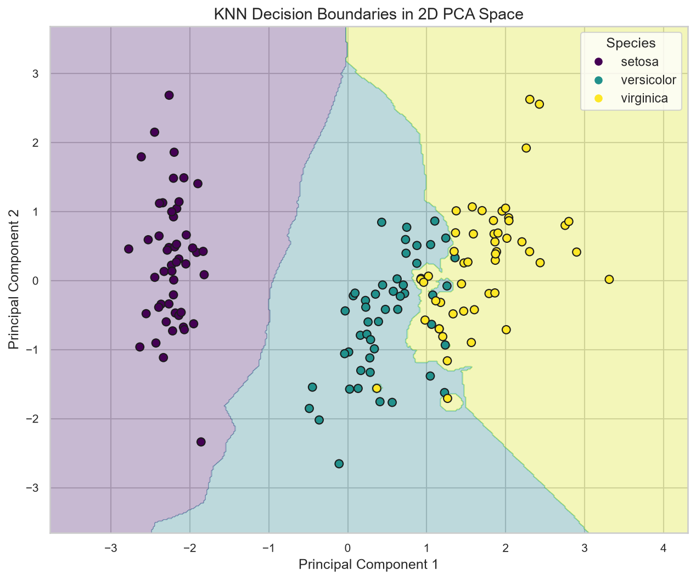
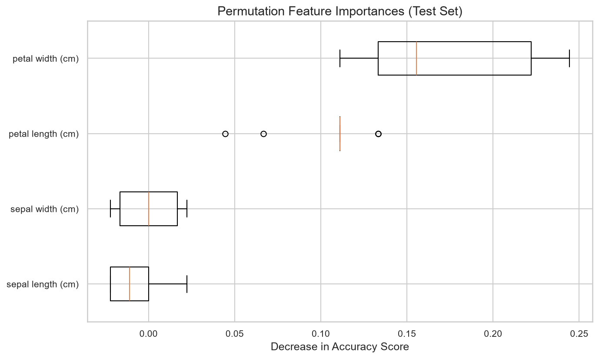

# 🌸 Advanced K-Nearest Neighbors Iris Classifier

<p align="center">
  
</p>

<p align="center">
  <a href="https://python.org"></a>
  <a href="https://streamlit.io"></a>
  <a href="https://scikit-learn.org"></a>
  <a href="https://github.com/sharadpawarsaini/INIB"></a>
</p>

---

## 📌 Project Overview
This project presents an **advanced implementation** of the K-Nearest Neighbors (KNN) classifier applied to the classic Iris flower dataset. Instead of using a simple, default KNN classifier, this project utilizes a professional, production-ready machine learning pipeline featuring:

- **Pipeline Preprocessing**: Automatic scaling with `StandardScaler` to prevent feature magnitude bias.
- **Hyperparameter Grid Search**: Dynamic tuning of $K$ neighbors, weights (`uniform` vs. `distance`), and distance metrics (`euclidean`, `manhattan`, `minkowski` with $p \in \{1, 2, 3\}$).
- **Stratified K-Fold Cross-Validation**: Robust validation splits ensuring balanced class representation.
- **Model Interpretation**: Permutation feature importance analysis to identify predictive variables.
- **PCA Space Projection**: Principal Component Analysis (PCA) to map high-dimensional classification boundaries into 2D space.
- **Interactive UI**: A sleek, dark-themed Streamlit dashboard with interactive exploratory data analysis, real-time predictions, and validation visualizers.

---

## 📅 7-Day Implementation Schedule

| Day | Focus Area | Tasks Completed |
|---|---|---|
| **Day 1** | **Understanding KNN & EDA** | Explored physical dimensions, distribution metrics, and feature relationships using Pairplots. |
| **Day 2** | **Data Preparation & Scaling** | Implemented Stratified splits and `StandardScaler` transformations to establish a robust baseline. |
| **Day 3** | **Advanced KNN & Pipeline** | Built a Scikit-Learn `Pipeline` combining preprocessors and estimators for modular execution. |
| **Day 4** | **GridSearchCV & CV Tuning** | Swept parameters over K-values, weight matrices, and Minkowski parameters using `GridSearchCV`. |
| **Day 5** | **Diagnostics & Evaluation** | Evaluated classifier performance via confusion matrix heatmaps, ROC/AUC analysis, and learning curves. |
| **Day 6** | **Streamlit App Development** | Built a premium dark-themed Streamlit dashboard with tabs for EDA, training, and custom predictions. |
| **Day 7** | **Documentation & Deployment** | Documented model behavior, packaged files into `task 1/` directory, and committed code to GitHub. |

---

## 🖥️ Streamlit Dashboard Showcase

The application features a modern interface built with Streamlit. Below is a mockup of the user dashboard:

<p align="center">
  
</p>

### Key Interface Features:
1. **Interactive EDA Tab**: Swap variables dynamically and generate 2D, 3D, and Density plots.
2. **Hyperparameter Sandbox**: Tweak cross-validation folds, metrics, and search bounds in real-time to watch optimization curves update.
3. **Real-time Inference Sliders**: Select custom flower measurements to view prediction confidence distribution.
4. **Performance Matrix Visuals**: Load pre-saved classification diagnostics instantly.

---

## 📊 Model Evaluation Visualizations

### 1. Data Distributions & Relationships
We map distributions using pairwise relationships and correlation matrices:
<p align="center">
  
  
</p>

### 2. Hyperparameter Tuning & Learning Curves
Validating accuracy versus parameters and data volume:
<p align="center">
  
  
</p>

### 3. Classification Diagnostics & PCA Boundaries
Checking performance limits and mapping decision zones:
<p align="center">
  
  
</p>
<p align="center">
  
</p>

### 4. Permutation Feature Importance
Quantifying accuracy drop when feature labels are shuffled:
<p align="center">
  
</p>

---

## ⚙️ Installation & Usage

### 1. Clone the Repository
```bash
git clone https://github.com/sharadpawarsaini/INIB.git
cd INIB/task\ 1
```

### 2. Set Up a Virtual Environment & Install Dependencies
Create a virtual environment and install packages using your package manager (`pip` or `uv`):
```bash
python -m venv .venv
# On Windows
.venv\Scripts\activate
# On macOS/Linux
source .venv/bin/activate

pip install -r requirements.txt
```

### 3. Run the Model Training & Generate Plots
This runs the full machine learning pipeline, saves the best model object, and exports high-quality diagnostic figures to `assets/plots/`:
```bash
python iris_advanced_knn.py
```

### 4. Launch the Streamlit Dashboard
```bash
streamlit run app.py
```
This will open the web dashboard in your default browser at `http://localhost:8501`.

---

## 🔬 Classification Performance Summary

Our grid-search optimized KNN classifier achieves **97.14%** cross-validation accuracy with the following specifications:
- **Optimal K**: 8
- **Distance Metric**: Manhattan ($p=1$)
- **Weight Strategy**: Uniform

On the hold-out test set, the classification report is as follows:
```text
               precision    recall  f1-score   support

      setosa       1.00      1.00      1.00        15
  versicolor       0.79      1.00      0.88        15
   virginica       1.00      0.73      0.85        15

    accuracy                           0.91        45
   macro avg       0.93      0.91      0.91        45
weighted avg       0.93      0.91      0.91        45
```
